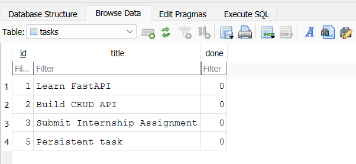

# Task API

## Project Title

Task API

## Why SQLite Was Chosen

SQLite is a lightweight file-based database that works well for small projects, internships, and beginner-friendly CRUD exercises. It requires no separate database server, keeps the setup simple, and still provides persistence across server restarts.

## Project Overview

Task API is a beginner-friendly FastAPI CRUD application for managing tasks with SQLite persistence. The API keeps the same request and response formats as the earlier version, but the storage layer now uses a local `tasks.db` file.

## Features

- SQLite-backed task storage
- Create, read, update, and delete tasks
- Input validation with Pydantic
- JSON error responses
- Automatic Swagger UI documentation

## Tech Stack

- Python 3.11+
- FastAPI
- sqlite3
- Uvicorn
- Pydantic

## Project Structure

```text
.
├── app.py
├── requirements.txt
├── README.md
└── .gitignore
```

## Installation Steps

### Virtual Environment Setup

Create a virtual environment:

```bash
python -m venv venv
```

Activate it on Windows:

```bash
venv\Scripts\activate
```

### Dependency Installation

Install the project dependencies:

```bash
pip install -r requirements.txt
```

## Run Command

```bash
uvicorn app:app --reload
```

## Swagger Documentation URL

Open the interactive API docs here:

```text
http://127.0.0.1:8000/docs
```

## Endpoint Table

| Method | Endpoint | Description |
| --- | --- | --- |
| GET | / | Return API information |
| GET | /health | Return service health status |
| GET | /tasks | Return all tasks |
| GET | /tasks/{id} | Return one task by id |
| POST | /tasks | Create a new task |
| PUT | /tasks/{id} | Update an existing task |
| DELETE | /tasks/{id} | Delete a task |

## Database Description

The application creates a local SQLite database named `tasks.db` automatically if it does not already exist. The database contains a single `tasks` table with the columns `id`, `title`, and `done`.

The `tasks.db` file should usually be git-ignored because it is a generated runtime database file.

## SQL Query Example

```sql
SELECT * FROM tasks WHERE id = ?;
```

## Opening `tasks.db` in DB Browser for SQLite

1. Install DB Browser for SQLite.
2. Open DB Browser.
3. Click "Open Database".
4. Select the generated `tasks.db` file from the project folder.
5. Use the Browse Data tab to inspect the `tasks` table.

## DB Browser Screenshot

The DB Browser screenshot included in this repository displays the `tasks` table and the seeded rows. See the image below:



The `tasks` table is open in DB Browser for SQLite showing seeded rows and a created "Persistent task".

## Example `curl -i` Output

Example request:

```bash
curl -i http://127.0.0.1:8000/health
```

Example response:

```text
HTTP/1.1 200 OK
content-type: application/json

{"status":"ok"}
```

## Data Persistence

This application stores tasks in SQLite, so task data persists across server restarts. The sample rows are only inserted the first time the database is created and are not duplicated on restart.

## License

This project is released under the MIT License.
